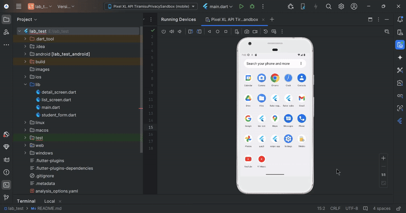

# Overview of the project

This is a simple Flutter application for managing student data. 
It allows users to add students' details (Name, Age, and GPA) and view them in a list. 
Users can also see the detailed information of each student by tapping on a list item.
The data is stored locally using shared_preferences.

# Features:

- Add student details: Name, Age, and GPA
- View a list of all students.
- Display detailed information for each student.
- Data storage using shared_preferences

# Screen recording

